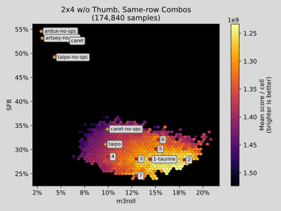
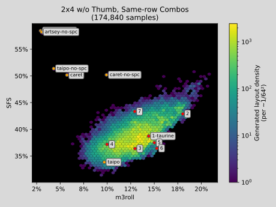
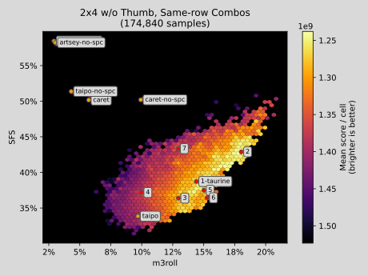

A layout generation library built on top of keycat.

# Upstream

Find the upstream repository here!

https://github.com/semilin/keywhisker

# Changes

Well, first I got really carried away with all this:

| Density | Score |
:-------------------------:|:-------------------------:
 | 
 | 
 | 
