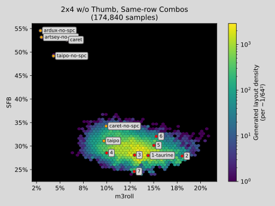

A layout generation library built on top of keycat.

# Upstream

Find the upstream repository here!

https://github.com/semilin/keywhisker

# Changes

Well, first I got really carried away with all this:

| Density | Score |
:-------------------------:|:-------------------------:
 | 
 | 
 | 

# License

The fantastic simulated-annealing approach has been adapted from
[DDAKO](https://github.com/sekaha/DDAKO) and should be considered
AGPLv3+.

Otherwise, code is GPLv3.

Images and documentation are CC-BY-SA 4.0.

Trivial files may be explictly licensed as CC0-1.0.
